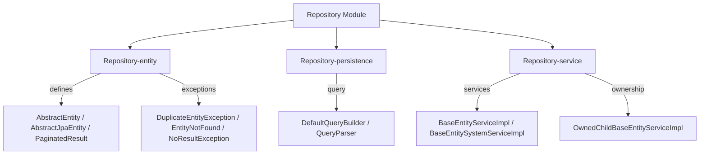
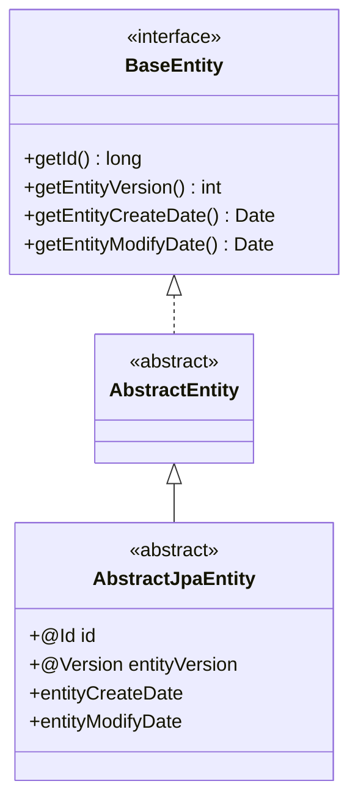

# Repository Module

The **Repository** module provides the base abstractions and implementations for persistence, entity management, and CRUD operations within the Water Framework. It defines a unified model for entities, queries, exceptions, services, and validation — serving as the foundation for all modules that require data persistence.

## Architecture Overview



## Sub-modules

| Sub-module | Description |
|---|---|
| **Repository-entity** | Base entity classes (`AbstractEntity`, `AbstractJpaEntity`), `PaginatedResult`, and persistence exceptions |
| **Repository-persistence** | Query building (`DefaultQueryBuilder`, `QueryParser`), filter/ordering/pagination support |
| **Repository-service** | Abstract service implementations for CRUD with permission, ownership, and validation support |

## Key Concepts

### Entity Hierarchy



- **AbstractJpaEntity** is the base class for all persistent entities, providing automatic ID generation, optimistic locking via `@Version`, and audit timestamps.

### Service Layer

The module provides two abstract service implementations:

| Class | Description |
|---|---|
| **BaseEntityServiceImpl\<T\>** | Public API implementation — delegates to `SystemApi`, enforces permission checks via annotations |
| **BaseEntitySystemServiceImpl\<T\>** | System API implementation — validates entities, manages persistence, handles ownership and shared entity filters |
| **OwnedChildBaseEntityServiceImpl\<T\>** | Extends `BaseEntityServiceImpl` for child entities with parent ownership relationships |

### CRUD Operations

All CRUD operations follow the same pattern:

```java
// Public API (with permission checks)
@AllowPermissions(actions = CrudActions.SAVE, checkById = true)
public T save(T entity) {
    return systemService.save(entity);
}

// System API (validation + persistence)
public T save(T entity) {
    validate(entity);
    return repository.persist(entity);
}
```

### Query Building

The `DefaultQueryBuilder` and `QueryParser` provide a fluent, technology-agnostic query API:

```java
// String-based filter
Query filter = filterBuilder.createQueryFilter("name=John AND status=ACTIVE");

// Programmatic query
Query query = queryBuilder.field("name").equalTo("John")
    .and(queryBuilder.field("status").equalTo("ACTIVE"));

// Paginated results
PaginableResult<MyEntity> results = myEntityApi.findAll(filter, 10, 1);
```

### Pagination

`PaginatedResult<T>` wraps query results with pagination metadata:

| Field | Description |
|---|---|
| `results` | List of entities for the current page |
| `numPages` | Total number of pages |
| `currentPage` | Current page number |
| `delta` | Page size |
| `nextPage` | Next page number |

### Persistence Exceptions

| Exception | Description |
|---|---|
| `DuplicateEntityException` | Unique constraint violation |
| `EntityNotFound` | Entity with given ID not found |
| `NoResultException` | Query returned no results |

### Ownership and Shared Entities

The service layer automatically handles:
- **Owned resources** — Entities implementing `OwnedResource` are filtered by the logged-in user's ID
- **Shared entities** — Entities implementing `SharedEntity` are visible to users who have been granted access
- **Automatic filtering** — `findAll` queries are automatically augmented with ownership/sharing filters

## Permission Enforcement

The public API layer uses security annotations for automatic permission checks:

| Annotation | Used On |
|---|---|
| `@AllowPermissions` | `save`, `update`, `find`, `remove` — checks entity-specific action permissions |
| `@AllowGenericPermissions` | Custom actions beyond CRUD |
| `@AllowPermissionsOnReturn` | `findAll` — validates permissions on returned entities |

## Usage Example

### Define an Entity

```java
@Entity
public class Product extends AbstractJpaEntity implements ProtectedEntity {
    @NotNullOnPersist
    @NoMalitiusCode
    private String name;

    private double price;
}
```

### Implement Services

```java
// System service
@FrameworkComponent
public class ProductSystemServiceImpl extends BaseEntitySystemServiceImpl<Product>
        implements ProductSystemApi {
    public ProductSystemServiceImpl() {
        super(Product.class);
    }
}

// Public API service
@FrameworkComponent
public class ProductServiceImpl extends BaseEntityServiceImpl<Product>
        implements ProductApi {
    @Inject
    private ProductSystemApi systemService;

    @Override
    protected BaseEntitySystemApi<Product> getSystemService() {
        return systemService;
    }
}
```

### Use CRUD Operations

```java
@Inject
private ProductApi productApi;

// Save
Product p = new Product();
p.setName("Widget");
p.setPrice(9.99);
Product saved = productApi.save(p);

// Find with pagination
PaginableResult<Product> results = productApi.findAll(null, 10, 1);

// Find with filter
Query filter = filterBuilder.createQueryFilter("price>5.0");
PaginableResult<Product> filtered = productApi.findAll(filter, 10, 1);

// Remove
productApi.remove(saved.getId());
```

## Configuration

| Property | Description | Default |
|---|---|---|
| Persistence unit | Configurable via JPA/Spring/OSGi | `water-default-persistence-unit` |
| Ownership filtering | Automatic for `OwnedResource` entities | Enabled |
| Pagination defaults | `delta` (page size), `page` (page number) | `delta=20`, `page=1` |

## Dependencies

- **Core-api** — `BaseEntityApi`, `BaseEntitySystemApi`, `BaseRepository`, `QueryBuilder`
- **Core-model** — `AbstractResource`, exceptions
- **Core-permission** — `@AllowPermissions`, `CrudActions`
- **Core-security** — Security context, `PermissionManager`
- **Core-validation** — Entity validation
